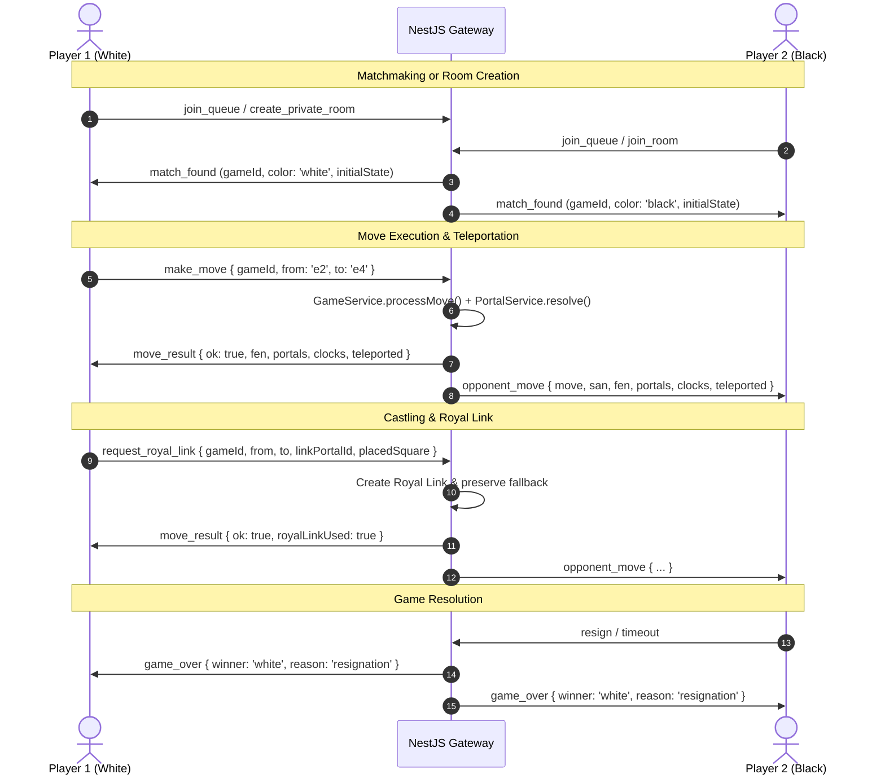

# 🌀 Portal Chess (Quantum Arena)

[](https://www.typescriptlang.org/)
[](https://reactjs.org/)
[](https://nestjs.com/)
[](https://socket.io/)
[](https://www.postgresql.org/)

> **Standard chess transformed with quantum teleportation wormholes.** Play solo against quantum AI, challenge a friend in pass-and-play, or duel online in real-time.

---

## 📑 Table of Contents
- [Core Gameplay Mechanics](#-core-gameplay-mechanics)
  - [1. Quantum Portals](#1-quantum-portals)
  - [2. Bishop Parity Rule](#2-bishop-parity-rule)
  - [3. King Check Avoidance](#3-king-check-avoidance)
  - [4. Portal Pawn Promotion](#4-portal-pawn-promotion)
  - [5. The Royal Link](#5-the-royal-link)
  - [6. Priority and Fallback Resolution](#6-priority-and-fallback-resolution)
- [System Architecture](#-system-architecture)
  - [Architecture Diagram](#architecture-diagram)
  - [WebSocket Communication Lifecycle](#websocket-communication-lifecycle)
- [Repository Structure](#-repository-structure)
- [Game Modes](#-game-modes)
- [Getting Started](#-getting-started)
  - [Prerequisites](#prerequisites)
  - [Running with Docker Compose](#running-with-docker-compose)
  - [Running Locally](#running-locally)
- [License](#-license)

---

## ♟️ Core Gameplay Mechanics

### 1. Quantum Portals
- At game start, **2 to 4 portal pairs** spawn randomly on ranks 3 to 6.
- Any piece moving into a portal square instantly teleports to the paired exit square.
- If an opponent piece occupies the exit square, it is **captured upon exit**.

### 2. Bishop Parity Rule
- Bishops are bound to their square color (light or dark). A bishop can **only traverse a portal** if the destination square matches its native square color.

### 3. King Check Avoidance
- A King is forbidden from teleporting into a square where it would be in **check**.
- When such a move is attempted, teleportation is blocked, the King safely remains on the entrance square, and a warning alert is displayed.

### 4. Portal Pawn Promotion
- If a pawn reaches the enemy back rank (Rank 8 for White, Rank 1 for Black) via a portal teleport, it **immediately promotes to a Queen**.

### 5. The Royal Link
- **Activation**: Triggered strictly when castling ($O-O$ or $O-O-O$) before move 15.
- **Power**: A one-time ability allowing the player to place a new Golden Portal linked to an existing portal on the board.
- Standard King moves do not trigger the Royal Link.

### 6. Priority and Fallback Resolution
- When a portal is linked to both a Royal Link and a standard portal, the **Royal Link has first priority**.
- If the Royal Link square is occupied by a **friendly piece** (or would put the King in check), the piece automatically falls back and warps through the secondary connected portal instead.

---

## 🏛️ System Architecture

### Architecture Diagram

```mermaid
flowchart TB
    subgraph Client["Frontend Client (React 19 + TypeScript + Vite)"]
        UI["UI Components\n(GameBoard, PortalOverlay, GameInfo, Lobby)"]
        Hook["useChessGame Hook\n(State Orchestrator & Clock Engine)"]
        Sound["SoundEffects Service\n(Web Audio API Synthesizer)"]
        AI["Quantum AI Engine\n(Minimax with Portal Evaluation)"]
        CG["Chessground & Chess.js\n(Board Renderer & Move Legality)"]
        WSClient["Socket.io Client\n(Realtime Network Layer)"]

        UI --> Hook
        Hook --> CG
        Hook --> Sound
        Hook --> AI
        Hook --> WSClient
    end

    subgraph Network["Network Transport"]
        HTTP["HTTP / REST API\n(Auth & History)"]
        WS["WebSocket Channels\n(Events & Teleport State)"]
    end

    subgraph Server["Backend Server (NestJS 10 + TypeScript)"]
        Gateway["GameGateway\n(WebSocket Gateway & Events)"]
        GameSvc["GameService\n(State, Turn, Timeout & Move Processing)"]
        PortalSvc["PortalService\n(Spawn, Parity & Warp Destination Logic)"]
        MM["MatchmakingService\n(Queue & ELO Buckets)"]
        AuthSvc["AuthService\n(JWT Authentication & Security)"]
        AntiCheat["AntiCheatService\n(SAN Validation & Move Verification)"]

        Gateway --> GameSvc
        Gateway --> MM
        GameSvc --> PortalSvc
        GameSvc --> AntiCheat
    end

    subgraph Persistence["Data & Cache Layer"]
        PG[("PostgreSQL\nUsers, Games, Moves, Ratings")]
        Redis[("Redis\nMatchmaking Queue & Active Sessions")]
    end

    WSClient <-->|WebSocket Events| WS <--> Gateway
    UI <-->|REST Requests| HTTP <--> AuthSvc
    GameSvc --> PG
    AuthSvc --> PG
    MM --> Redis
```



### WebSocket Communication Lifecycle



---

## 📂 Repository Structure

```text
Portalandpawns/
├── client/                     # React + Vite + TypeScript Frontend
│   ├── public/                 # Static assets (portal-chess.svg, favicon)
│   ├── src/
│   │   ├── components/         # GameBoard, PortalOverlay, GameInfo, Lobby, etc.
│   │   ├── hooks/              # useChessGame (core state), useAuth
│   │   ├── utils/              # portalRules, portalAi, soundEffects
│   │   ├── types.ts            # Type definitions (Portal, GameState, MovePayload)
│   │   ├── App.tsx             # Main shell & navigation
│   │   └── App.css             # Theme, portal vortices, keyframes, neon effects
│   ├── index.html              # HTML entry with custom SVG favicon
│   └── package.json
│
├── server/                     # NestJS 10 Backend
│   ├── src/
│   │   ├── auth/               # JWT authentication, guards, user management
│   │   ├── database/           # TypeORM entities (User, Game, Move, GameState)
│   │   ├── game/               # Gateway, GameService, PortalService, Matchmaking
│   │   └── main.ts             # Server bootstrap & CORS configuration
│   ├── test/                   # Integration and unit tests
│   └── package.json
│
├── docker-compose.yml          # Container orchestration (Client, Server, Postgres, Redis)
├── PROJECT_SUMMARY.md          # Comprehensive functional & feature summary
└── README.md                   # Project overview, rules, and architecture
```

---

## 🎮 Game Modes

| Mode | Description | Server Needed? |
|---|---|:---:|
| **Solo vs Quantum AI** | Battle our intelligent engine across Novice, Adept, and Master difficulty levels. | ❌ No |
| **Pass & Play** | Local two-player face-to-face game with digital clocks and auto-flip board. | ❌ No |
| **Sandbox Board** | Free sandbox to test portal connections, check scenarios, and move combinations. | ❌ No |
| **Online Matchmaking** | Queue against online players matched by Elo rating buckets. | ✅ Yes |
| **Private Room duel** | Create a 6-character room code to invite a friend remotely. | ✅ Yes |

---

## 🚀 Getting Started

### Prerequisites
- **Node.js**: v18.0 or higher
- **npm**: v9.0 or higher
- **Docker & Docker Compose** *(optional, for full containerized stack)*

---

### Running with Docker Compose

To start the complete stack including PostgreSQL, Redis, NestJS Backend, and React Frontend:

```bash
docker-compose up --build
```

- **Frontend**: `http://localhost:5173`
- **Backend API & WebSockets**: `http://localhost:3000`

---

### Running Locally

#### 1. Start Backend Server
```bash
cd server
npm install
npm run start:dev
```
The NestJS server will start on `http://localhost:3000`.

#### 2. Start Frontend Client
```bash
cd client
npm install
npm run dev
```
The client will start on `http://localhost:5173`.

#### 3. Playing Online with a Remote Friend (Public Internet)

To play with a friend anywhere in the world without port-forwarding:

1. Double-click `play-online.bat` (or run `.\cloudflared.exe tunnel --url http://localhost:5173` while frontend and backend are running).
2. Copy the generated public HTTPS URL (e.g., `https://*.trycloudflare.com`).
3. Send this link to your friend.
4. One player clicks **"Create Room"** in the Lobby to generate a 6-character room code, and the other enters the code in **"Join Room"** (or both click **"Quick Match"**).
5. Both players instantly connect via real-time WebSocket over the secure tunnel!

---

#### 4. Run Unit Tests
```bash
cd server
npm test
```

---

## 🌐 Deploying Online for Free

To host Portal Chess on a live public website for free with automatic GitHub deployments:
- **Backend**: Deploy on **[Render](https://render.com)** (Free Node.js & WebSocket Service)
- **Frontend**: Deploy on **[Vercel](https://vercel.com)** (Free Global Edge CDN)

👉 Follow the full step-by-step walkthrough in [**DEPLOYMENT.md**](DEPLOYMENT.md).

---

## 📜 License
This project is open-source and available under the [MIT License](LICENSE).
